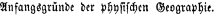

layout: true
  
<div class="my-header"></div>

<div class="my-footer">
  <table>
    <tr>
      <td style="text-align:right">Sächsische Landesbibliothek – Staats- und Universitätsbibliothek</td>
      <td>Würzner</td>
      <td style="text-align:right"><a href="https://www.slub-dresden.de/" style="visibility:hidden">www.slub-dresden.de</a></td>
    </tr>
    <tr>
      <td style="text-align:right">Sorbisches Institut</td>
      <td>Böhmak</td>
    </tr>
  </table>
</div>

<div class="my-title-footer">
  <table>
    <tr>
      <td style="text-align:left"><b>Wito Böhmak</b></td>
      <td style="text-align:right"><b>Kay-Michael Würzner</b></td>
    </tr>
    <tr>
      <td style="text-align:left">Sorbisches Institut Bautzen</td>
      <td style="text-align:right">SLUB Dresden</td>
    </tr>
    <tr>
      <td style="font-size:8pt"><b>14.September 2023</b></td>
    </tr>
    <tr>
      <td style="font-size:8pt">Workshop „KI-gestützte Texterkennung bei ‚kleinen‘ Sprachen“</td>
    </tr>
  </table>
</div>

---

class: title-slide
count: false

# Automatische Texterkennung für ressourcenarme Sprachen
## am Beispiel des Obersorbischen

---

# Überblick

- Hintergründe zum Obersorbischen
- Maschinelles Lernen am Beispiel der automatischen Texterkennung
- Produktiver Workflow mit Werkzeugen aus OCR-D
- Diskussionsimpulse

---

class: part-slide
count: false

# Hintergründe zum Obersorbischen

---

# Hintergründe zum Obersorbischen
.cols[
.fifty[
[Obersorbisch - hornjoserbšćina](https://www.sorabicon.de/hsb/kulturlexikon/artikel/prov_gs5_2lv_23b/)
- westslawische Sprache
    * Sorbisch = Niedersorbisch und Obersorbisch
    * 20000–25000 Sprecherinnen und Sprecher in der Oberlausitz
    * zwischen Bautzen (Budyšin), Kamenz (Kamjenc) und Hoyerswerda (Wojerecy) 
    * im Deutschen bis 1945 *Wendisch* benannt
]
.fourty[
<p style="margin-top:-20px">

</p>
]
]

---

# Hintergründe zum Obersorbischen

.cols[
.fifty[
- obersorbische Schriftsprache der Gegenwart
    * Vereinheitlichung zweier Traditionslinien
    * katholisches und evangelisches Schrifttum
- erstes gedrucktes obersorbisches Buch 1595: *Wjacław Warichius* „Der kleine Catechismus“
    * Anfang 18. Jh.: zwei obersorbische Schriftsprachenvarianten
    * Mitte des 19. Jh.: Bestrebungen zur Vereinheitlichung (analog Rechtschreibung, Antiqua)
]
.fourty[
<p style="margin-top:-30px">

</p>
]
]

---

# Sorbisches Institut

.cols[
.fifty[
- Gründung Anfang 1992
    * außeruniversitäre Einrichtung zur Erforschung von Sprache, Geschichte und Kultur der Sorben in der Ober- und Niederlausitz
    * Vorgänger: 1951–1991 Institut für sorbische Volksforschung in der DDR
    * sorbisches wissenschaftliche Institut in Tradition der *Maćica Serbska*
- zwei standortübergreifende (Bautzen und Cottbus) Forschungsabteilungen
    * Kulturwissenschaften und Sprachwissenschaft 
]
.fourty[

    ]
    ]

---

# Sorbisches Institut

- öffentliche wissenschaftliche Bibliothek und Archiv mit Forschungs- und Servicecharakter (Sorbische Zentralbibliothek und Sorbisches Kulturarchiv)
- „Lětopis“ als interdisziplinäres Fachorgan
    * zwei spezifische Schriftenreihen sowie digitale Angebote
- mehr als 70 Mitarbeiter (hoher Anteil an Drittmittel-Projekten)

---

# Ausgangssituation

- Digitalisierungen am SI seit 15 Jahren
- Landesdigitalisierungsprogramm (LDP) Sachsen,  
  koordiniert am Dresdner Digitalisierungszentrum der SLUB
- 2016–2017 im Rahmen des LDP Digitalisierung historischen Schrifttums: 
    + Antiqua – ungenügende Volltext-Qualität
    + Fraktur – keine Volltext-Erzeugung
- besonderes Problem **Fraktur Sorbisch**: 
    - slawische Diakritika, bisher keine verlässliche automatische Texterkennung (OCR)
    - mehrere Schreibweisen, Übergänge

---

# Sorbische Druckzeichen Antiqua/Fraktur


<center>

</center>

<div style="font-size:8pt">
*Jan Arnošt Smoler: Mały Sserb aby Serske a Njemske Rosmłowenja atd. = Wendisch-Deutsche Gespräche nebst einem wendisch-deutschen und deutsch-wendischen Wörterbuche, sowie einem Verzeichnisse von Ortsnamen, einer Darlegung der Aussprache und Orthographie und Zugabe der gebräuchlichen Eidesnormen, Bautzen 1841*
</div>

---

# Wo noch? – Fraktur und Antiqua Tschechisch


<div style="font-size:8pt">
*Alphabete orientalischer und occidentalischer Sprachen,  
zsgest. von Friedrich Ballhorn, 8., verb. Aufl., Leipzig 1859*
</div>

---

# Wissenschaftlich nachnutzbare Volltexte
 
<!-- Für wen? -->


- aus den Quellen erzeugter, **strukturierter Volltext**
    * adäquate digitale Repräsentation des Drucks
    * Wörter, Sätze, Abschnitte, Artikel, Kapitel etc.
- Bespielung von Präsentationssystemen
    - qualitative Nutzung
    - u.a. für Editionen, Heimatforschung, breiten Bildungsbereich
- Belieferung von Forschungsdateninfrastrukturen
    - quantitative Nutzung
    - u.a. für Search/Retrieval, Textkorpora, Sprachstatistik

<!-- GT: manuell erfasster Text (idealerweise fehlerfrei), mit -Text-Zuordnung -->
<!-- Minderheitensprache/ressourcenknappe Sprache -->
<!-- Synergien zwischen Zwecken und Rollen der Beitragenden -->

---

# Beispiel: Serbske Nowiny 1878 (Fraktur)

<table>
   <tr>
        <td>        

        </td>
        <td>

        </td>
    </tr>
</table>


---

count: false

# Beispiel: Serbske Nowiny 1878 (Fraktur)

<table>
   <tr>
        <td>        

        </td>
        <td>

        </td>
    </tr>
</table>


```xml
<head><lb/>Ze Serbow.</head>
<p>
<lb/>
S Budyſchina. Jene nowiny w tychle dnjach žortniwje
<lb/>
měnjachu, ſo je ſapocžatk nalěcźa lětſa tak hubjeny był, ſo to ani
<lb/>
najſtarſche žaby pomnicź njemóža, a ſo drje ßu ſchkórzy hwiſdali,
<lb/>
ale to najſkerje teho dla, ſo bychu ßo trochu ſhrěli...
</p>
```

---

class: part-slide
count: false

# Maschinelles Lernen am Beispiel der automatischen Texterkennung

---

# Kurze Einführung OCR

.cols[
.sixty[
- Bilderfassung ≠ Texterfassung
- **O**ptical **C**haracter **R**ecognition: Automatische Erfassung von Text in Bildern
- ursprünglich begrenzt auf Zeichenerkennung
- heute häufig Synonym für den gesamten Texterfassungsprozess
  + Bildvorverarbeitung
  + Layoutanalyse (OLR)
  + Zeilenerkennung
  + ...
]
.fourty[
<center></center>
]
]

---

# Komponenten eines einfachen OCR-Workflows

.cols[
.fifty[
]
.fourty[
<p style="margin-top:-80px">

</p>
]
]

---

count: false

# Komponenten eines einfachen OCR-Workflows

.cols[
.fifty[
- Bildvorverarbeitung
]
.fourty[
<p style="margin-top:-80px">

</p>
]
]

---

count: false

# Komponenten eines einfachen OCR-Workflows

.cols[
.fifty[
- Bildvorverarbeitung
]
.fourty[
<p style="margin-top:-80px">

</p>
]
]

---

count: false

# Komponenten eines einfachen OCR-Workflows

.cols[
.fifty[
- Bildvorverarbeitung
- Layoutanalyse
]
.fourty[
<p style="margin-top:-80px">

</p>
]
]

---

count: false

# Komponenten eines einfachen OCR-Workflows

.cols[
.fifty[
- Bildvorverarbeitung
- Layoutanalyse
]
.fourty[
<p style="margin-top:-80px">

</p>
]
]

---

count: false

# Komponenten eines einfachen OCR-Workflows

.cols[
.fifty[
- Bildvorverarbeitung
- Layoutanalyse
    * **strukturierende** Elemente
        + Absätze
        + Überschriften
]
.fourty[
<p style="margin-top:-80px">

</p>
]
]

---

count: false

# Komponenten eines einfachen OCR-Workflows

.cols[
.fifty[
- Bildvorverarbeitung
- Layoutanalyse
    * **strukturierende** Elemente
        + Absätze
        + Überschriften
    * **textflussunterbrechende** Elemente
        + Seitenzahlen
        + Kolumnentitel
        + Abbildungsunterschriften
        + Marginalien etc.
]
.fourty[
<p style="margin-top:-80px">

</p>
]
]

---

count: false

# Komponenten eines einfachen OCR-Workflows

.cols[
.fifty[
- Bildvorverarbeitung
- Layoutanalyse
    * **strukturierende** Elemente
        + Absätze
        + Überschriften
    * **textflussunterbrechende** Elemente
        + Seitenzahlen
        + Kolumnentitel
        + Abbildungsunterschriften
        + Marginalien etc.
    * **nichttextuelle** Elemente
        + Abbildungen
        + Tabellen etc.
]
.fourty[
<p style="margin-top:-80px">

</p>
]
]

---

count: false

# Komponenten eines einfachen OCR-Workflows

.cols[
.fifty[
- Bildvorverarbeitung
- Layoutanalyse
    * **strukturierende** Elemente
        + Absätze
        + Überschriften
    * **textflussunterbrechende** Elemente
        + Seitenzahlen
        + Kolumnentitel
        + Abbildungsunterschriften
        + Marginalien etc.
    * **nichttextuelle** Elemente
        + Abbildungen
        + Tabellen etc.
- Texterkennung
]
.fourty[
<p style="margin-top:-80px">

</p>
]
]

---

# Texterkennung: Zeichenorientierte Ansätze

.cols[
.seventy[
- Erkennung erfolgt *glyphenweise*
  - **Mustervergleich**: Vergleich der Zeichenbilder zu in einem „Setzkasten“ gespeicherten Glyphen **Pixel für Pixel**
  - **Merkmalsvergleich**: Zerlegung der Glyphen in vordefinierte, bedeutungstragende **Eigenschaften** wie *Einfärbung*, *Kurven*, *Linien* etc. und Vergleich zu Referenzmaterialien
]
.fourty[
<center></center>
]
]

---

count: false

# Texterkennung: Zeichenorientierte Ansätze

.cols[
.seventy[
- Erkennung erfolgt *glyphenweise*
  - **Mustervergleich**: Vergleich der Zeichenbilder zu in einem „Setzkasten“ gespeicherten Glyphen **Pixel für Pixel**
  - **Merkmalsvergleich**: Zerlegung der Glyphen in vordefinierte, bedeutungstragende **Eigenschaften** wie *Einfärbung*, *Kurven*, *Linien* etc. und Vergleich zu Referenzmaterialien
]
.fourty[
<center></center>
]
]
- *regelbasiertes Vorgehen*
    + **direkte** Abbildung von Referenzmaterial
    + Modellierung von Expertenwissen
- Zerlegung der Seite in *Zeilen* und *Zeichen* notwendig

---

# Texterkennung: Zeilenorientierte Ansätze

- Erkennung erfolgt *zeilenweise*
  1. **Skalierung:** einheitliche Höhe für alle Zeilen
  2. **Merkmalsextraktion**: Raster mit festgelegter Anzahl (horizontaler) Zeilen und variabler Anzahl (vertikaler) Spalten → Zeilen als Sequenzen binärwertiger Vektoren fixer Länge
<center></center>
- kontextsensitive Erkennung über *Übergangswahrscheinlichkeiten* der Vektoren
- Zerlegung der Seite in *Zeilen* notwendig
- Vorgehen robuster gegenüber Varianz durch Artefakte als zeichenorientierte Ansätze
- `Tesseract` (ab Version 4), `OCRopus`, `kraken`, `Calamari`
  + Einsatz *neuronaler Netze* für die Sequenzklassifikation

---

# Texterkennung: Zeilenorientierte Ansätze

- zentrales Verfahren des maschinellen Lernens (cf. e.g. [Xing et al. 2010](https://www.cs.sfu.ca/~jpei/publications/Sequence%20Classification.pdf))
- basierend auf dem **Satz von Bayes**: `\(P(C|E) = \frac{P(E|C)\cdot P(C)}{P(E)}\)`
- Rezept
    + Man nehme
        * eine **sehr große** Liste **manuell annotierter** Daten und
        * einen **Trainingsalgorithmus**,
    + modelliere eine **`n:n`-Beziehung** zwischen Eingabe und Ausgabe,
        * e.g., jedes Eingabeelement (Buchstabe) wird auf eine Klasse abgebildet
    + induziere ein **statistisches Modell**,
    + und evaluiere dessen Qualität anhand von **Evaluationsdaten**

---

# Texterkennung: Zeilenorientierte Ansätze

- Übertragung auf OCR
    + Daten
        * https://htr-united.github.io/
        * manuell transkribierte Textzeilen
    + Kodierung `\(f: \mathbb{N}^{10}\rightarrow\mathbb{B}\)` 
      $$
      f(x[n]) = \begin{cases} 1 & \text{Pixel in Zelle $(x,n)$ schwarz} \\\\
      0 & \, \text{sonst}\end{cases}
      $$ 
    + Training
        * Zählen von Sequenzen aus Vektor-Buchstabenteil-Paaren
        * Repräsentation als OCR-Modell
        * Tesseract: [tesstrain](https://github.com/tesseract-ocr/tesstrain)
.cols[
.fifty[
```
  0123456789
0 1111111111
2 0000110000 
```
]
.fifty[
<center>

</center>
]
]

---

# Texterkennung: Trainingsdaten

- fehlerfreies Referenzmaterial, sog. **Ground Truth**
    + Mapping von Zeilen-Bildern auf maschinenlesbaren codierten Text
    + entsprechend Konventionen (z.B. OCR-D-Richtlinien)
    + direkter Zusammenhang von Konventionen und Texterkennung
    + manuelle Erstellung (von Null oder aufbauend auf bereits erzeugtem Text, ggf. iterativ)
- aus Daten werden sog. **Modelle** erzeugt

<center>

</center>

---

# Texterkennung: Trainingsdaten

- Lücken in Transkriptionsrichtlinien  
    * z.B. `"` vs. `“` oder `—` vs. `–` oder `⸗` vs. `-`
- zu wenige Beispiele für große Fonts und für spezifische Zeichen
- Wandel historischer Schreibweisen
    * z.B. am Übergang von Überpunkt zu Akut; Druckschwäche? 
      
    * Absicht?
      
    * beschränkter Drucksatz?
      

---


# Texterkennung: Training und Evaluierung


- Umfang der GT-Daten
    + Fraktur: &gt; 16.000 Zeilen (1843–1911)
    + Antiqua: &gt; 16.000 Zeilen (1880–1934, 1950–)
- [Training von Modellen](https://github.com/bertsky/hsbcala) für Tesseract / Calamari …
    + auf Basis existierender Modelle
- Zeichenfehlerraten (CER) auf Test-GT:

|CER OCR|Abbyy Srv14† | Tesseract | hsb (Tess) | hsb (Cala) | hsb (multi) 
| ---------- | ---------- | -------- | ------------- |-------- |-------- |
|Fraktur‡  | 14,72% | 9,01% |0,56% | 0,45%  | 0,37% |
|Antiqua   |  ⁜  | 2,17%   |  0,89%  | 0,52%    | 0,48% |


<div style="font-size:8pt">
† Abbyy repräsentiert `ſ` als `s`<br/>
‡ v.a. Überpunkt vs. Akut<br/>
⁜ Stichproben mit Abbyy: bei Korrektur von ĕ (e breve) nach ě (e caron): < 1%<br/>
</div>

---

# *Layoutanalyse* per Pixelklassifizierung

.cols[
.fifty[
]
.fourty[
<p style="margin-top:-30px">

</p>
]
]

---

count: false

# *Layoutanalyse* per Pixelklassifizierung

.cols[
.fifty[
- Training auf manuell strukturierten Seiten
- jedes Pixel gehört in ein Segment
- jedes Pixel gehört zu einer Klasse
]
.fourty[
<p style="margin-top:-30px">

</p>
]
]

---

count: false

# *Layoutanalyse* per Pixelklassifizierung

.cols[
.fifty[
- Training auf manuell strukturierten Seiten
- jedes Pixel gehört in ein Segment
- jedes Pixel gehört zu einer Klasse
]
.fourty[
<p style="margin-top:-30px">

</p>
]
]

---

count: false

# *Layoutanalyse* per Pixelklassifizierung

.cols[
.fifty[
- Training auf manuell strukturierten Seiten
- jedes Pixel gehört in ein Segment
- jedes Pixel gehört zu einer Klasse
    + Illustration durch Farbe pro Segmenttyp
]
.fourty[
<p style="margin-top:-30px">

</p>
]
]

---

count: false

# *Layoutanalyse* per Pixelklassifizierung

.cols[
.fifty[
- Training auf manuell strukturierten Seiten
- jedes Pixel gehört in ein Segment
- jedes Pixel gehört zu einer Klasse
    + Illustration durch Farbe pro Segmenttyp
]
.fourty[
<p style="margin-top:-30px">

</p>
]
]

---

count: false

# *Layoutanalyse* per Pixelklassifizierung

.cols[
.fifty[
- Training auf manuell strukturierten Seiten
- jedes Pixel gehört in ein Segment
- jedes Pixel gehört zu einer Klasse
    + Illustration durch Farbe pro Segmenttyp
- Klassifikation der Pixel anhand ihrer **Umgebung** (i.e. Farbe im Original)
]
.fourty[
<p style="margin-top:-30px">

</p>
]
]

---

count: false

# *Layoutanalyse* per Pixelklassifizierung

.cols[
.fifty[
- Training auf manuell strukturierten Seiten
- jedes Pixel gehört in ein Segment
- jedes Pixel gehört zu einer Klasse
    + Illustration durch Farbe pro Segmenttyp
- Klassifikation der Pixel anhand ihrer Umgebung (i.e. Farbe im Original)
    + beliebig komplexe Schemata möglich
        * Text vs. Nichttext
]
.fourty[
<p style="margin-top:-30px">

</p>
]
]

---

count: false

# *Layoutanalyse* per Pixelklassifizierung

.cols[
.fifty[
- Training auf manuell strukturierten Seiten
- jedes Pixel gehört in ein Segment
- jedes Pixel gehört zu einer Klasse
  + Illustration durch Farbe pro Segmenttyp
- Klassifikation der Pixel anhand ihrer Umgebung (i.e. Farbe im Original)
  + beliebig komplexe Schemata möglich
      * Text vs. Nichttext
]
.fourty[
<p style="margin-top:-30px">

</p>
]
]

---

class: part-slide
count: false

# Produktiver Workflow mit Werkzeugen aus OCR-D

---

# Produktiver Workflow mit Werkzeugen aus OCR-D

1. Erstellung Bilddigitalisate
2. Layoutanalyse mit `Eynollah`
3. ggf. manuelle Korrektur (Regionen und Textfluss)
4. Texterkennung mit `Tesseract` und `Calamari`
5. ggf. semiautomatische Textkorrektur
6. Konvertierung in Basis-TEI mit `mm2tei`
7. ggf. manuelle Korrekturen (insb. Worttrennung)
8. tiefergehende TEI-Auszeichnung (log. Struktur)

---

# Erstellung Bilddigitalisate

.cols[
.fifty[

]
.fifty[
]
]

---

count: false

# Erstellung Bilddigitalisate

.cols[
.fifty[

]
.fifty[

]
]

---

# Layoutanalyse mit Eynollah

.cols[
.fifty[
- [quelloffenes](https://github.com/qurator-spk/eynollah) Werkzeug (cf. [Rezanezhad 2023](https://doi.org/10.1145/3604951.3605513))
    * kombiniert **maschinelles Lernen** und **Heuristiken**
    * trainierbar, frei verfügbare Basismodelle
    * Erkennung von:
        + Seitenrändern
        + Linien und Ornamentierung
        + Blocksegmentierung und Textfluss
        + Zeilensegmentierung
    * OCR-D-Wrapper
]
.fourty[
]
]

---

count: false

# Layoutanalyse mit Eynollah

.cols[
.fifty[
- [quelloffenes](https://github.com/qurator-spk/eynollah) Werkzeug (cf. [Rezanezhad 2023](https://doi.org/10.1145/3604951.3605513))
    * kombiniert **maschinelles Lernen** und **Heuristiken**
    * trainierbar, frei verfügbare Basismodelle
    * Erkennung von:
        + Seitenrändern
        + Linien und Ornamentierung
        + Blocksegmentierung und Textfluss
        + Zeilensegmentierung
    * OCR-D-Wrapper
]
.fourty[
<p style="margin-top:-30px">

</p>
]
]

---

count: false

# Layoutanalyse mit Eynollah

.cols[
.fifty[
- [quelloffenes](https://github.com/qurator-spk/eynollah) Werkzeug (cf. [Rezanezhad 2023](https://doi.org/10.1145/3604951.3605513))
    * kombiniert **maschinelles Lernen** und **Heuristiken**
    * trainierbar, frei verfügbare Basismodelle
    * Erkennung von:
        + Seitenrändern
        + Linien und Ornamentierung
        + Blocksegmentierung und Textfluss
        + Zeilensegmentierung
    * OCR-D-Wrapper
]
.fourty[
<p style="margin-top:-30px">

</p>
]
]

---

count: false

# Layoutanalyse mit Eynollah

.cols[
.fifty[
- [quelloffenes](https://github.com/qurator-spk/eynollah) Werkzeug (cf. [Rezanezhad 2023](https://doi.org/10.1145/3604951.3605513))
    * kombiniert **maschinelles Lernen** und **Heuristiken**
    * trainierbar, frei verfügbare Basismodelle
    * Erkennung von:
        + Seitenrändern
        + Linien und Ornamentierung
        + Blocksegmentierung und Textfluss
        + Zeilensegmentierung
    * OCR-D-Wrapper
- manuelle Korrektur
]
.fourty[
<p style="margin-top:-30px">

</p>
]
]

---

count: false

# Layoutanalyse mit Eynollah

.cols[
.fifty[
- [quelloffenes](https://github.com/qurator-spk/eynollah) Werkzeug (cf. [Rezanezhad 2023](https://doi.org/10.1145/3604951.3605513))
    * kombiniert **maschinelles Lernen** und **Heuristiken**
    * trainierbar, frei verfügbare Basismodelle
    * Erkennung von:
        + Seitenrändern
        + Linien und Ornamentierung
        + Blocksegmentierung und Textfluss
        + Zeilensegmentierung
    * OCR-D-Wrapper
- manuelle Korrektur
]
.fourty[
<p style="margin-top:-30px">

</p>
]
]

---

# Texterkennung

.cols[
.fifty[
- viele verfügbare **OCR-Engines**
- [`Tesseract`](https://github.com/tesseract-ocr/tesseract)
    + ursprünglich von HP entwickelt
    + von Google übernommen und Open-Source gestellt
    + viele **mitgelieferte Modelle** (auch für „kleinere“ Sprachen)
    + ab Version 4 mit neuronalen Netzen
- [`OCRopus`](https://github.com/tmbdev/ocropy)
    + entwickelt von Thomas Breul
    + ebenfalls auf Basis neuronaler Netze
    + nur **wenige mitgelieferte Modelle**
    + weitere „Inkarnationen“
        * [`kraken`](http://kraken.re/), [`Calamari`](https://github.com/Calamari-OCR/calamari)
]
.fourty[
<p style="margin-top:-30px">

</p>
]
]

---

# Texterkennung

.cols[
.fifty[
- Prozesse zur **Vereinigung** verschiedener OCR-Ergebnisse in einen Volltext
    + **unterschiedliche Engines** bzw. Modelle haben **unterschiedliche Stärken** und machen unterschiedliche Fehler
    + **Extraktion** korrekter Textbestandteile [**aus mehreren OCR-Durchgängen**](https://www.researchgate.net/profile/John_Handley/publication/3776858_Improving_OCR_accuracy_through_combination_a_survey/links/0deec51e9c21900ab4000000/Improving-OCR-accuracy-through-combination-a-survey.pdf)
        * **Selbsteinschätzung** als Entscheidungskriterium
        * Integration vorhandener OCR ebenfalls möglich!
]
.fourty[
<p style="margin-top:-30px">

</p>
]
]

---

# Semiautomatische Textkorrektur


.cols[
.fifty[
- Nachnutzung der freien Rechtschreibkorrektur [`hunspell`](https://hunspell.github.io/)
    * obersorbische Musterliste auf Basis von [`soblex`](https://soblexx.de)
    * auch für Browser etc. nutzbar
- Identifikation und ggf. Korrektur nicht erkannter Wörter
    * einfaches, selbstgebautes Webinterface
    * gewisse Anzahl an **Falschnegativen**
        + unschön für die Bearbeitung
        + Integration in Lexikon
    * gewisse Anzahl an **Falschpositiven**
        + „Quasihomographe“ (*sto* vs. *što*)
]
.fourty[

]
]

---

# TEI-Konvertierung

- METS/ALTO: de-facto Standard für Repräsentation digitaler Volltexte in Bibliotheken
    * von der DFG empfohlene Formate für Digitalisierung
    * Anschluss an Präsentationssysteme
    * **Standoff Markup** für Text, Layout, Struktur → **seitenzentriert**
    * Anwendungsbeispiel: [Serbske Nowiny 23.3.1878 (DFG-Viewer)](http://digital.serbski-institut.de/ska-sn23031878_3u4)
- TEI-XML: de-facto Standard für Repräsentation digitaler Volltexte in der Wissenschaft
    * von der DFG empfohlenes Format für Korpora
    * Anschluss an Forschungsinfrastrukturen
    * **Inline Markup** für Text, Layout, Struktur → **dokumentzentriert**
- [`mm2tei`](https://github.com/slub/mets-mods2tei) als Brücke zwischen beiden Welten
    * Minimalauszeichnung
    * schrittweise manuelle Ergänzung

---

class: part-slide
count: false

# Diskussionsimpulse

---

# Diskussionsimpulse: kommerzielle OCR

- kommerzielle OCR
   + Abbyy, Google CloudVision, Amazon Textract
   + Datenhoheit (Transkribus)

---

# Diskussionsimpulse: Double Keying

- Double Keying


---

# Diskussionsimpulse: Layouterkennung

- Layouterkennung
    + komplexe Layouts
    + Textfluss
    + logische Struktur
    + zyklische „Abhängigkeiten“
    + richtig wäre: Segmentierung, Texterkennung, Segmentklassifizierung

---

# Diskussionsimpulse: Beyond OCR

- Ressourcenarmut
    + bei OCR mit viel Mühe aufgeschlossen
    + weitergehende Annotationen
        * PoS-Tagging
        * NER

---

class: part-slide

# Many thanks for your attention!

<center>
<a href="https://wrznr.github.io/ocr-ressourcenarme-sprachen-2023/">wrznr.github.io/ocr-ressourcenarme-sprachen-2023</a>
</center>

---

count: false

## Was macht eine hochqualitative Texterkennung aus?

- *gute Segmentierung*: Ist der Text richtig lokalisiert worden?  
  (kein Text verloren, kein Nicht-Text verwechselt)
   + scheinbare/fehlende Wörter oder Zeilen
   + überlappende/abgeschnittene Zeichen
- *gute OCR*: Sind die Zeichen an sich richtig erkannt worden?
- *gute Strukturerkennung*: Sind die Blöcke und Zeilen in der richtigen Reihenfolge? Wurden Überschriften markiert? Wurden Kapitel/Artikel separiert?
- *weitere Analyse*: Schriftauszeichnung, Textnormalisierung


<!-- → **OCR-Workflow** -->

<!-- 2. Kasten zu "Zeilensegmentierung", 3. Kasten zu "Struktur + Reihenfolge", Artikelerkennung zu "Artikelseparierung" 

außerdem: 2. Kasten vor dem 1. Kasten

-->


<!-- Ende WB -->
---

count: false

## Strukturerkennung – warum? 

**Ziel ist Artikelseparierung**
- Erstellung einer qual. hochwertigen Präsentation
- Artikelextraktion (in TEI) für Textkorpora
- siehe [Masterplan Zeitungsdigitalisierung](https://zeitschriftendatenbank.de//fileadmin/user_upload/ZDB/z/Masterplan.pdf), Stufe 3a Artikelseparierung

<!-- und wie machen wir das? -->

**Unser Workflow:**

<!-- und jetzt sind wir endlich hier hinten -->


<!-- Ende WB -->

---

count: false

## Strukturerkennung – was?

<!-- Basis ist Blockreihenfolge aus OCR-D  -->

- Seitenstruktur (Segmentierung + Reihenfolge): PAGE oder ALTO
- Dokumentstruktur (Titel, Kapitel, Abschnitt, Legende, Seitenzahl, Artikel):  
  Repräsentation…
  + nach **DFG-Anwendungsprofil** für METS/ALTO:  
    `mets:div/@LABEL` + `mets:structLink` (mit ALTO-fileGrp)  
    → ganze Seiten <!-- oft auch: max. 1 Eintrag pro Seite -->
  + nach **Europeana-Profil** für METS/ALTO:  
    `mets:div/mets:fptr` (ALTO-fileID) `./mets:area` (ALTO-IDREF)  
    → 1..n Segmente unterhalb+oberhalb von Seiten  

Anwendungsbeispiel: [Serbske Nowiny 23.3.1878 (DFG-Viewer)](http://digital.serbski-institut.de/ska-sn23031878_3u4)

---

count: false

## Strukturerkennung – wie?

<div class="col-container">
    <div class="col80">
        
- automatische Strukturerkennung:
  + [regelbasiert](https://github.com/OCR-D/ocrd_segment):  
    vorherige seitenweise Textblock-Lesereihenfolge + heuristische (visuell-textuelle) Artikelseparierung
  + [datengetrieben](https://github.com/CITlabRostock/citlab-article-separation-new):  
    neuronale Netze mit visuell-textueller Eingabe
<!-- Ende RS -->
- Unterstützung durch Präsentation: 
   + Kitodo/DFG-Viewer: bisher nur `mets:structLink`
   + [TEI-Konvertierung](https://github.com/slub/mets-mods2tei): bisher nur `mets:structLink`
   + kommerzielle Systeme: `mets:area` / beides
   + [DDB-Zeitungsportal](https://www.fiz-karlsruhe.de/de/forschung/ddb-zeitungsportal-v-20#projektdaten): noch offen 

    </div>
    <div class="col20">
    
    
        
    (Bsp.: <a href="https://dokuwiki.digital-innsbruck.at/structify_archive">Structify</a>)

    </div>
</div>
